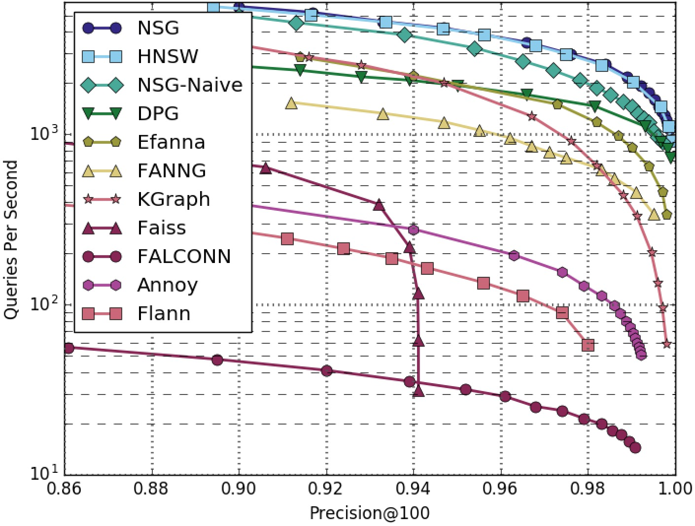
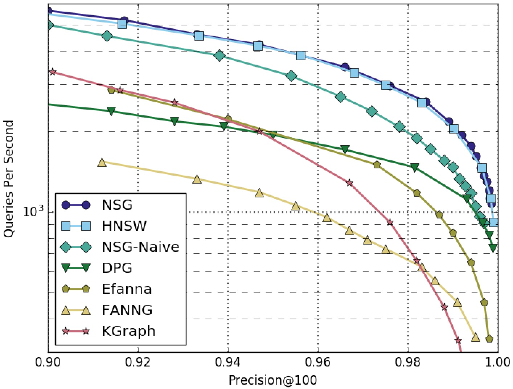
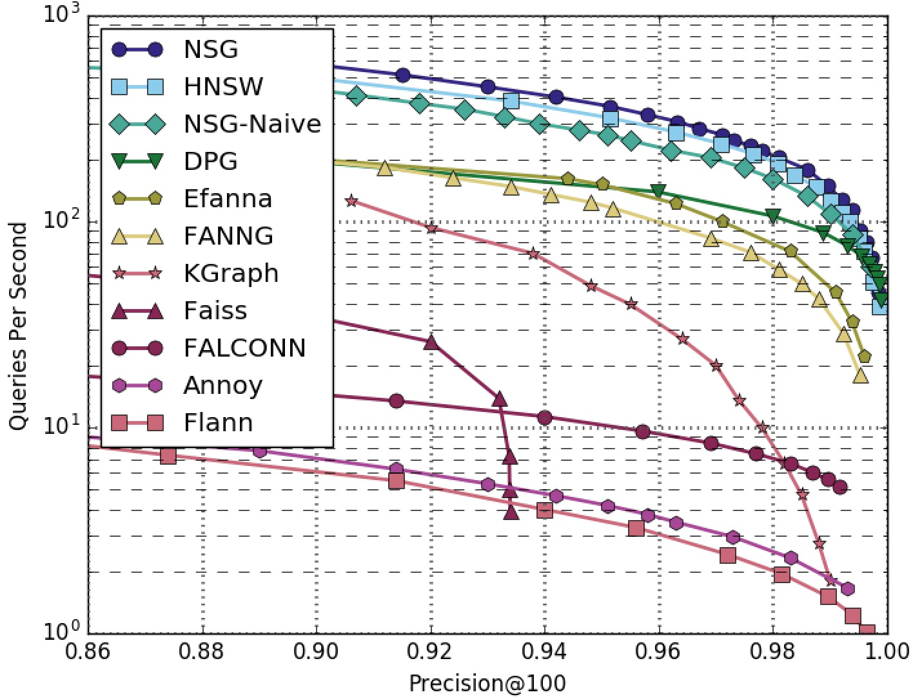
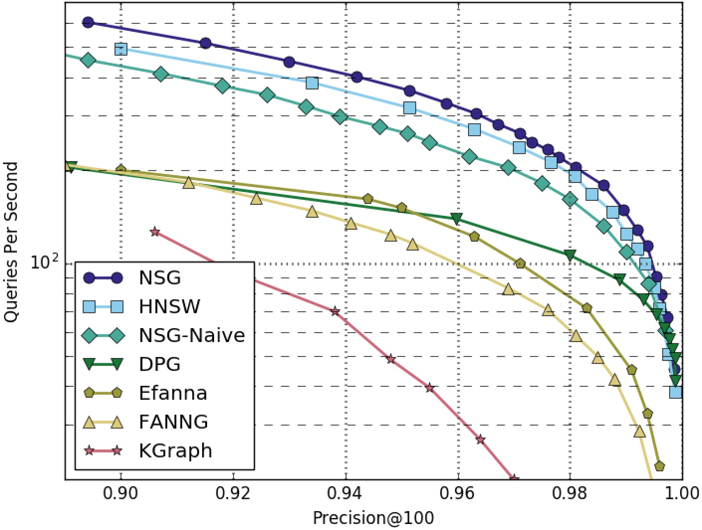
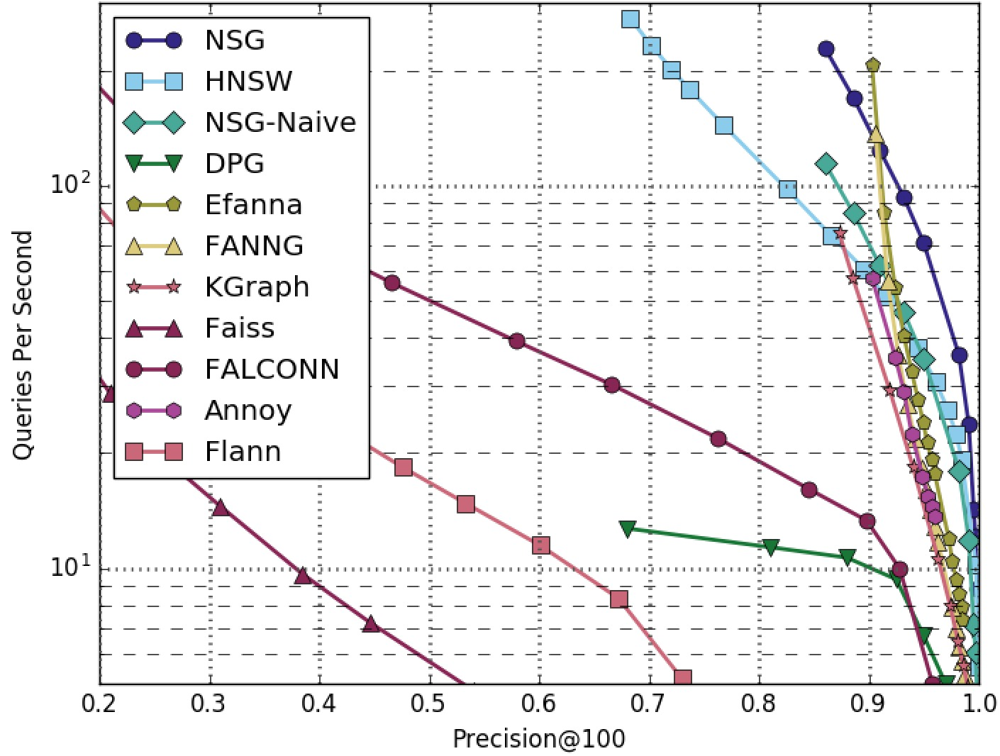
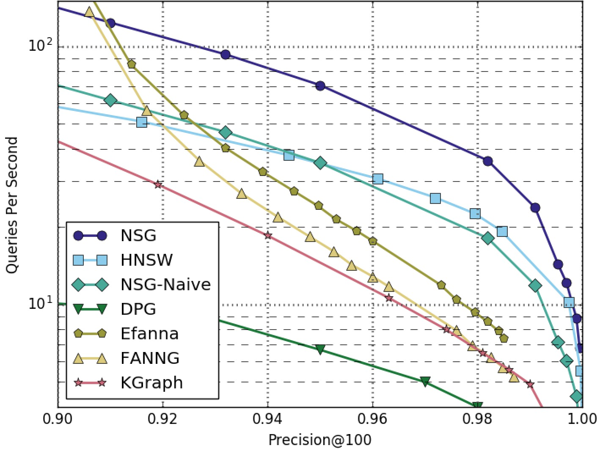
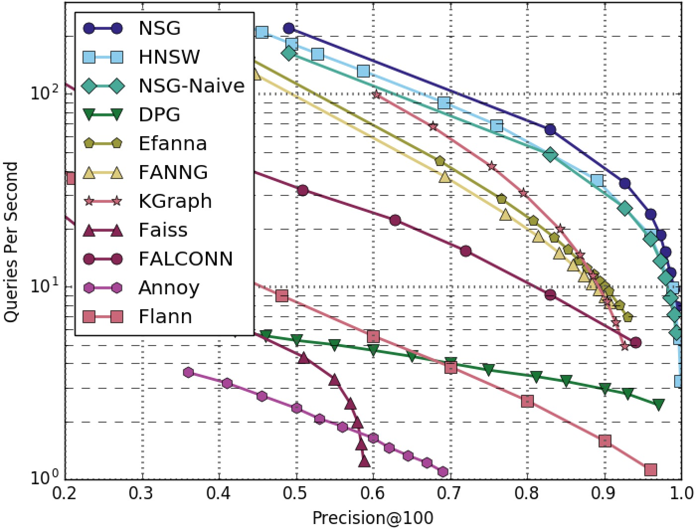
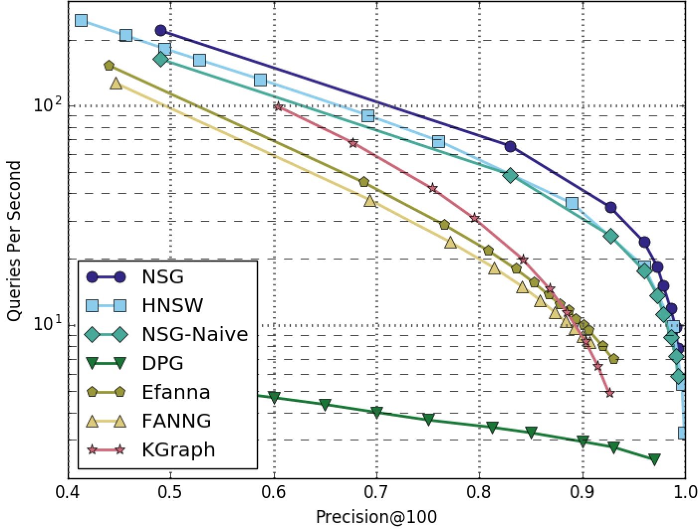

NSG : Navigating Spread-out Graph For Approximate Nearest Neighbor Search
======
NSG is a graph-based approximate nearest neighbor search (ANNS) algorithm. It provides a flexible and efficient solution for the metric-free large-scale ANNS on dense real vectors. It implements the algorithm of our paper, [Fast Approximate Nearest Neighbor Search With Navigating Spread-out Graphs.](https://arxiv.org/abs/1707.00143)   
NSG has been intergrated into the search engine of Taobao (Alibaba Group) for billion scale ANNS in E-commerce scenario.   

Benchmark data set
------
* [SIFT1M and GIST1M](http://corpus-texmex.irisa.fr/)    
* Synthetic data set: RAND4M and GAUSS5M
	* RAND4M: 4 million 128-dimension vectors sampled from a uniform distribution of [-1, 1].
	* GAUSS5M: 5 million 128-dimension vectors sampled from a gaussion ditribution N(0,3).   


ANNS performance
------

**Compared Algorithms:**    

Graph-based ANNS algorithms:
* [kGraph](http://www.kgraph.org)  
* [FANNG](https://pdfs.semanticscholar.org/9ea6/5687a21c869fce7ecf17ca25ffcadbf77d69.pdf) : FANNG: Fast Approximate Nearest Neighbour Graphs     
* [HNSW:code](https://github.com/searchivarius/nmslib),  [paper](https://arxiv.org/abs/1603.09320) : Efficient and robust approximate nearest neighbor search using Hierarchical Navigable Small World graphs      
* [DPG:code](https://github.com/DBWangGroupUNSW/nns_benchmark),  [paper](https://arxiv.org/abs/1610.02455) : Approximate Nearest Neighbor Search on High Dimensional Data --- Experiments, Analyses, and Improvement (v1.0)     
* [Efanna:code](https://github.com/fc731097343/efanna),  [paper](https://arxiv.org/abs/1609.07228) : EFANNA : An Extremely Fast Approximate Nearest Neighbor Search Algorithm Based on kNN Graph       
* NSG-naive: a designed based-line, please refer to [our paper](https://arxiv.org/abs/1707.00143).     
* NSG: This project, please refer to [our paper](https://arxiv.org/abs/1707.00143). 

Other popular ANNS algorithms
* [flann](http://www.cs.ubc.ca/research/flann/)       
* [FALCONN](https://github.com/FALCONN-LIB/FALCONN)      
* [Annoy](https://github.com/spotify/annoy)     
* [Faiss](https://github.com/facebookresearch/faiss)    

The performance was tested without parallelism.    
NSG achieved the **best** search performance among all the compared algorithms on all the four datasets.
Among all the ***graph-based algorithms***, NSG has ***the smallest index size*** and ***the best search performance***.  


**SIFT1M-100NN-All-Algorithms**



**SIFT1M-100NN-Graphs-Only**    

    

**GIST1M-100NN-All-Algorithms**      

    

**GIST1M-100NN-Graphs-Only**    

   

**RAND4M-100NN-All-Algorithms**      

    

**RAND4M-100NN-Graphs-Only**    

   

**GAUSS5M-100NN-All-Algorithms**      

    

**GAUSS5M-100NN-Graphs-Only**    

   

How to use
------
1. Compile    
	Prerequisite : openmp, cmake, boost    
	Compile:   
	
		$ cd nsg/     
		$ cmake .   
		$ make    
		
	
2. Usage      
	The main interfaces and classes have its respective test codes under directory tests/      
	Temporarilly several essential functions have been implemented. To use my algorithm, you should first build an index. It takes several steps as below:    
     
	**a) Build a kNN graph**    
   
    You can use [efanna\_graph](https://github.com/ZJULearning/efanna\_graph) or [kgraph](https://github.com/aaalgo/kgraph) to build the kNN graph, or you can build the kNN graph by yourself.
    	
    **b)Convert a kNN graph to a NSG**        
	For example:  
	```
	$ cd tests/ 	 
	$ ./test_nsg_index data_path nn_graph_path L R save_graph_file     
	```
	**data\_path** is the path of the origin data.    
	**nn\_graph\_path** is the path of the pre-built kNN graph.      
	**L** controls the quality of the NSG, the larger the better, L > R.       
	**R** controls the index size of the graph, the best R is related to the intrinsic dimension of the dataset.   
	
    **c) Use NSG for search**     
	For example:     
	```
	$ cd tests/
	$ ./test_nsg_optimized_search data_path query_path nsg_path search_L search_K result_path    
	```
	**data\_path** is the path of the origin data.     
	**query\_path** is the path of the query data.      
	**nsg\_path** is the path of the pre-built NSG.    
	**search\_L** controls the quality of the search results, the larger the better but slower. The **search_L** cannot be samller than the **search_K**  
	**search\_K** controls the number of neighbors we want to find.      

    For now, we only provide interface for search for only one query at a time, and test the performance with single thread.     
	There is another program in tests folder which is test_nsg_search. The parameters of test_nsg_search are exactly same as test_nsg_optimized_search. 
    test_nsg_search is slower than test_nsg_optimized_search but requires less memory. In the situations memory consumption is extremely important, one can use test_nsg_search instead of test_nsg_optimized_search.

Note    
------
**The data\_align()** function we provided is essential for the correctness of our procedure, because we use SIMD instructions for acceleration of numerical computing such as AVX and SSE2.     
You should use it to ensure your data elements (feature) is aligned with 8 or 16 int or float.     
For example, if your features are of dimension 70, then it should be extend to dimension 72. And the last 2 dimension should be filled with 0 to ensure the correctness of the distance computing. And this is what data\_align() does.    

Only data-type int32 and float32 are supported for now.     

Input of NSG
------
Because there is no unified format for input data, users may need to write input function to read your own data. You may imitate the input function in our sample code in the *tests/* directory to load the data.     

Output of NSG
------
The output format of the search results follows the same format of the **fvecs** in [SIFT1M](http://corpus-texmex.irisa.fr/)     

Parameters to get the index in Fig. 4/5 in [our paper](https://arxiv.org/abs/1707.00143). (We use [efanna_graph](https://github.com/ZJULearning/efanna_graph) to build the kNN graph)      
------

You need to usee the tool fvec2lshkit in the kgraph folder to convert the data in fvecs format to the data format kgraph program knows:

        $kgraph/fvec2lshkit sift.fvecs sift.data

Then you can use kgraph to build an approximate kNN graph. And then you can use nsg:
		
        $efanna_graph/tests/test_nndescent sift.fvecs sift.50nngraph 50 70 8 10 100     
        $nsg/tests/test_nsg_index sift.fvecs sift.50nngraph 90 40 sift.nsg   

        $kgraph/index -I 15 -L 300 -S 20 -R 100 gist.data kgraph.result     
        $nsg/tests/kgraph2ivec kgraph.result gist.300nngraph
        $nsg/tests/test_nsg_index gist.fvecs gist.100nngraph 200 70 gist.nsg  
		
	
        $nsg/tests/test_nsg_index rand4m.fvecs rand4m.200nngraph 400 200 rand4m.nsg        
        $nsg/tests/test_nsg_index gauss5m.fvecs gauss5m.200nngraph 500 200 gauss5m.nsg   
		

Performance on Taobao E-commerce data
------
**Environments:**   
Xeon E5-2630.      
**Single thread test:**    
Dataset:  10,000,000 128-dimension vectors.     
Latency:  1ms (average) on 10,000 query.   
**Distributed search test:**     
Dataset:  45,000,000 128-dimension vectors.  
Distribute:  randomly divide the dataset into 12 subsets and build 12 NSGs. Search in parallel and merge results.     
Latency:  1ms (average) on 10,000 query.        

